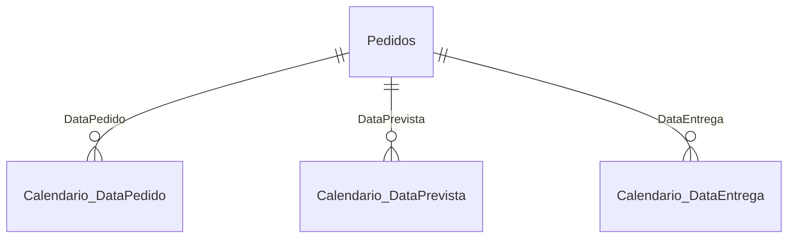

# Análise OTIF (On Time In Full) — Logística de Pedidos

Dashboard em Power BI para acompanhamento de performance logística, com foco no indicador **OTIF** (percentual de pedidos entregues no prazo e sem ocorrências).

## Contexto

O modelo consolida pedidos de transporte/entrega e calcula, para cada pedido, se ele foi entregue **dentro do prazo previsto** (`OnTime`) e **sem ocorrências de devolução** (`InFull`). A combinação dos dois compõe o indicador OTIF, usado para medir a qualidade do processo de entrega ponta a ponta.

## Fonte de Dados

| Item | Detalhe |
|---|---|
| Origem | Arquivo Excel (`.xlsx`) local |
| Modo de conexão | Import |
| Tabela | `Pedidos` |
| Volume | 139.254 linhas |
| Período coberto | 25/07/2018 a 14/03/2023 |

### Tratamento no Power Query (M)

- Promoção de cabeçalhos e remoção de linhas de metadados do relatório de origem.
- Conversão de tipos (texto, data, inteiro) por coluna.
- Renomeação de `NroPedido` → `ID_Pedido`.
- **Split** da coluna `Destino` em três colunas (`Região`, `UF`, `Cidade`), usando `/` e `*` como delimitadores.

## Modelo de Dados

Esquema estrela simples: uma tabela fato (`Pedidos`) conectada a três tabelas calendário automáticas do Power BI (uma para cada data de referência do pedido).



### Tabela `Pedidos`

| Coluna | Tipo | Descrição |
|---|---|---|
| `ID_Pedido` | Texto | Identificador do pedido |
| `Região` | Texto | Região de destino (extraída de `Destino`) |
| `UF` | Texto | Estado de destino |
| `Cidade` | Texto | Cidade de destino |
| `DataPedido` | Data | Data de criação do pedido |
| `DataPrevista` | Data | Data prevista de entrega |
| `DataEntrega` | Data | Data real de entrega |
| `ID_Veiculo` | Inteiro | Identificador do veículo |
| `OcorrenciaDevolucao` | Inteiro | Código de ocorrência (0 = sem ocorrência) |
| `MotivoOcorrencia` | Texto | Motivo da ocorrência, quando houver |
| `ResponsabilidadeOcorrencia` | Texto | Parte responsável pela ocorrência |
| `Placa` | Texto | Placa do veículo |
| `Carroceria` | Texto | Tipo de carroceria |
| `TipoVeiculo` | Texto | Tipo de veículo |
| `Filial` | Texto | Filial responsável |
| `OnTime` *(calculada)* | Texto | "Sim"/"Não" — ver fórmula abaixo |

**Coluna calculada `OnTime`:**
```dax
OnTime =
IF(
    Pedidos[DataEntrega] <= Pedidos[DataPrevista] && Pedidos[DataEntrega] <> BLANK(),
    "Sim",
    "Não"
)
```

## Relacionamentos

| De | Coluna | Para | Cardinalidade | Filtro |
|---|---|---|---|---|
| Pedidos | DataPedido | Date Table (auto) | Muitos-para-um | Direção única |
| Pedidos | DataPrevista | Date Table (auto) | Muitos-para-um | Direção única |
| Pedidos | DataEntrega | Date Table (auto) | Muitos-para-um | Direção única |

## Medidas DAX

| Medida | Fórmula | Descrição |
|---|---|---|
| `Pedidos` | `COUNTROWS(Pedidos)` | Total de pedidos |
| `OnTime` | `CALCULATE([Pedidos], Pedidos[OnTime] = "Sim")` | Pedidos entregues no prazo |
| `Ocorrencias` | `CALCULATE([Pedidos], Pedidos[OcorrenciaDevolucao] <> 0)` | Pedidos com ocorrência |
| `InFull` | `CALCULATE([Pedidos], Pedidos[OcorrenciaDevolucao] = 0)` | Pedidos sem ocorrência |
| `%OnTime` | `DIVIDE([OnTime], [Pedidos])` | % de pontualidade |
| `% InFULL` | `DIVIDE([InFull], [Pedidos])` | % de integridade (sem ocorrência) |
| `Otif` | `[% InFULL] * [%OnTime]` | Indicador OTIF combinado |

## Indicador OTIF

O OTIF é calculado como o produto entre o percentual de pontualidade (`%OnTime`) e o percentual de integridade (`% InFULL`), refletindo a proporção de pedidos que atendem **simultaneamente** os dois critérios:

```
OTIF = %OnTime × %InFull
```

## Stack Técnica

- **Power BI Desktop** (compatibility level 1606)
- **Power Query (M)** para ETL
- **DAX** para medidas e coluna calculada
- Fonte: planilha Excel local
