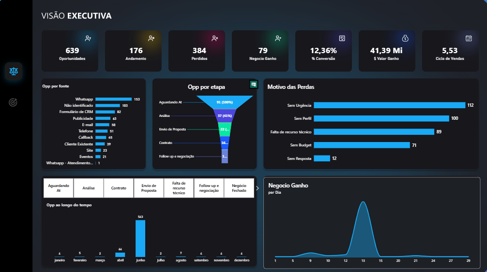
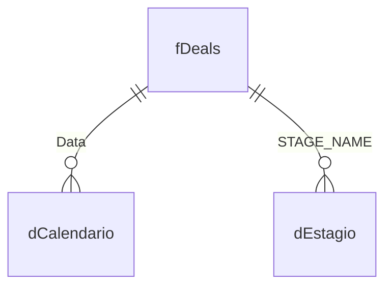

# Funil de Vendas — Bitrix24 CRM

Dashboard em Power BI para acompanhamento do funil de vendas exportado do **Bitrix24 CRM**, com foco em taxa de conversão, ciclo de vendas e valores de negócios (ganhos, em aberto e perdidos), multi-moeda.



🔗 [Relatório publicado no Power BI](https://app.powerbi.com/view?r=eyJrIjoiNGVmZTY2ZjQtMDA2Ny00MjdiLTlhYmEtZTliNzNmNzE2YjE0IiwidCI6ImNmZGQ2YTU0LTE2ZDgtNGQyYS1iMzA5LTdiMWNiMDk0YzI0MyJ9)

## Contexto

O modelo consome o export de negociações (*deals*) do Bitrix24 e reconstrói o funil comercial: quantas oportunidades foram criadas, em qual estágio cada uma está, e o resultado final (ganho, perdido ou em andamento), segmentado por vendedor e por período.

## Fonte de Dados

| Item | Detalhe |
|---|---|
| Origem | Arquivo CSV local (`Deals.csv`), delimitador `;`, exportado do Bitrix24 |
| Modo de conexão | Import |
| Tabela fato | `fDeals` |
| Volume | 639 negócios |
| Período coberto | 21/07/2022 a 03/07/2023 |
| Vendedores (responsáveis) | 10 |
| Estágios do funil | 11 |

### Tratamento no Power Query (M)

- Leitura do CSV bruto do Bitrix24 (28 colunas originais) e promoção de cabeçalhos.
- Conversão de tipos e **seleção apenas das colunas relevantes** (`ID`, `DATE_CREATE`, `TITLE`, `STAGE_SEMANTIC_ID`, `STAGE_SEMANTIC`, `OPPORTUNITY_ACCOUNT`, `ACCOUNT_CURRENCY_ID`, `ASSIGNED_BY_NAME`, `STAGE_NAME`, `SOURCE_NAME`, `ciclo`).
- Extração da data de criação (`DATE_CREATE`) a partir de um timestamp textual, gerando a coluna `Data`.
- Padronização de valores: `SOURCE_NAME` vazio → `"Não identificado"`; `STAGE_NAME` "aguardando atendimento" → `"Aguardando At"`.
- **Merge** com `dEstagio` para trazer o `STAGE_ID` (chave numérica do estágio) para dentro da fato.
- A tabela `dEstagio` é derivada da própria base de deals: extrai os nomes de estágio únicos e aplica uma **coluna condicional customizada** para atribuir a ordem correta do funil (`STAGE_ID` de 1 a 11), já que a ordem alfabética não reflete a sequência real do processo comercial.

## Modelo de Dados

Esquema estrela: tabela fato `fDeals` conectada a uma dimensão calendário (gerada dinamicamente a partir do próprio intervalo de datas dos deals) e a uma dimensão de estágio do funil.



### Tabela fato `fDeals`

| Coluna | Tipo | Descrição |
|---|---|---|
| `ID` | Inteiro | Identificador do negócio |
| `TITLE` | Texto | Título do negócio |
| `Data` | Data | Data de criação do negócio |
| `ASSIGNED_BY_NAME` | Texto | Responsável pelo negócio |
| `STAGE_NAME` | Texto | Nome do estágio atual |
| `STAGE_SEMANTIC` | Texto | Descrição semântica do status (em andamento/ganho/perdido) |
| `STAGE_SEMANTIC_ID` | Texto | Código semântico: `P` (em andamento), `S` (ganho/*success*), `F` (perdido/*failure*) |
| `SOURCE_NAME` | Texto | Origem/canal do lead |
| `OPPORTUNITY_ACCOUNT` | Decimal | Valor da oportunidade |
| `ACCOUNT_CURRENCY_ID` | Texto | Moeda do valor (`BRL`, `USD`) |
| `ciclo` | Inteiro | Dias de ciclo de vendas do negócio |
| `dEstagio.STAGE_ID` | Número | Chave do estágio, trazida via merge com `dEstagio` |

### Tabela `dEstagio`

| Coluna | Tipo | Descrição |
|---|---|---|
| `STAGE_NAME` | Texto | Nome do estágio (chave de relacionamento) |
| `STAGE_ID` | Número | Ordem lógica do estágio no funil (1 a 11), definida manualmente |

Ordem do funil (`STAGE_ID` → estágio → semântica):

| STAGE_ID | Estágio | Semântica |
|---|---|---|
| 1 | Aguardando At | Negócio em andamento |
| 2 | Análise | Negócio em andamento |
| 3 | Follow up e negociação | Negócio em andamento |
| 4 | Envio de Proposta | Negócio em andamento |
| 5 | Contrato | Negócio em andamento |
| 6 | Negócio Fechado | Negócio ganho |
| 7 | Sem Budget | Negócio perdido |
| 8 | Sem Urgência | Negócio perdido |
| 9 | Sem Perfil | Negócio perdido |
| 10 | Falta de recurso técnico | Negócio perdido |
| 11 | Sem Resposta | Negócio perdido |

### Tabela `dCalendario`

Gerada via M customizado, com intervalo calculado automaticamente a partir de `List.Min`/`List.Max` sobre `fDeals[Data]` (do início do ano mínimo ao fim do ano máximo). Colunas: `Ano`, `NomeMes`, `MesAbre`, `MesAno`, `MesNum`, `AnoMesINT`, `Trimestre`, `TrimestreAbreviado`, `Bimestre`, `Semestre`, `Semana`, `DiaSemana`, `NomeDia`.

## Relacionamentos

| De | Coluna | Para | Cardinalidade | Filtro |
|---|---|---|---|---|
| fDeals | Data | dCalendario | Muitos-para-um | Direção única |
| dCalendario | Data | Date Table (auto) | Muitos-para-um | Direção única |
| fDeals | STAGE_NAME | dEstagio | Muitos-para-um | Direção única |

## Medidas DAX

### Volume de negócios

| Medida | Fórmula | Descrição |
|---|---|---|
| `Oportunidades` | `DISTINCTCOUNTNOBLANK(fDeals[ID])` | Total de negócios (oportunidades) |
| `Negocio Ganho` | `CALCULATE([Oportunidades], fDeals[STAGE_SEMANTIC_ID] = "S")` | Negócios fechados com sucesso |
| `Andamento` | `CALCULATE([Oportunidades], fDeals[STAGE_SEMANTIC_ID] = "P")` | Negócios ainda em andamento |
| `Perdido` | `CALCULATE([Oportunidades], fDeals[STAGE_SEMANTIC_ID] = "F")` | Negócios perdidos |
| `% Conversão` | `[Negocio Ganho] / [Oportunidades]` | Taxa de conversão do funil |
| `Ciclo de Vendas` | `AVERAGE(fDeals[ciclo])` | Tempo médio (dias) do ciclo de vendas |

### Valores financeiros (multi-moeda, convertidos para BRL)

| Medida | Fórmula | Descrição |
|---|---|---|
| `$ Valor Ganho` | Soma `OPPORTUNITY_ACCOUNT` de negócios ganhos, com valores em `USD` convertidos por uma taxa fixa de câmbio (`× 5`) e somados aos valores já em `BRL` | Valor total fechado |
| `$ Valor em Aberto` | Mesma lógica, filtrando negócios em andamento (`STAGE_SEMANTIC_ID = "P"`) | Valor em negociação (pipeline aberto) |
| `$ Valor Perdido` | Mesma lógica, filtrando negócios perdidos (`STAGE_SEMANTIC_ID = "F"`) | Valor perdido no período |

Exemplo (`$ Valor Ganho`):
```dax
$ Valor Ganho =
VAR vUSD =
CALCULATE(
    SUM(fDeals[OPPORTUNITY_ACCOUNT]),
    fDeals[STAGE_SEMANTIC_ID] = "S",
    fDeals[ACCOUNT_CURRENCY_ID] = "USD"
)
VAR vBRL =
CALCULATE(
    SUM(fDeals[OPPORTUNITY_ACCOUNT]) * 5,
    fDeals[STAGE_SEMANTIC_ID] = "S",
    fDeals[ACCOUNT_CURRENCY_ID] = "BRL"
)
RETURN
vUSD + vBRL
```

> A taxa de câmbio USD→BRL está fixa em `5` diretamente na medida (não é um parâmetro dinâmico) — ponto de atenção para manutenção futura do modelo.

## Principais números do dashboard

- **639** oportunidades no total, **176** em andamento, **384** perdidas, **79** ganhas
- **% Conversão**: 12,36%
- **Valor Ganho**: R$ 41,39 Mi
- **Ciclo de Vendas médio**: 5,53 dias
- Principal fonte de leads: **Não identificado** (183) e **WhatsApp** (153)
- Principal motivo de perda: **Sem Urgência** (112), seguido de **Sem Perfil** (100) e **Falta de recurso técnico** (89)

## Stack Técnica

- **Power BI Desktop**
- **Power Query (M)**, incluindo geração dinâmica da tabela calendário e enriquecimento de dimensão via merge
- **DAX** para métricas de funil, conversão e consolidação multi-moeda
- Fonte: exportação CSV do **Bitrix24 CRM**
