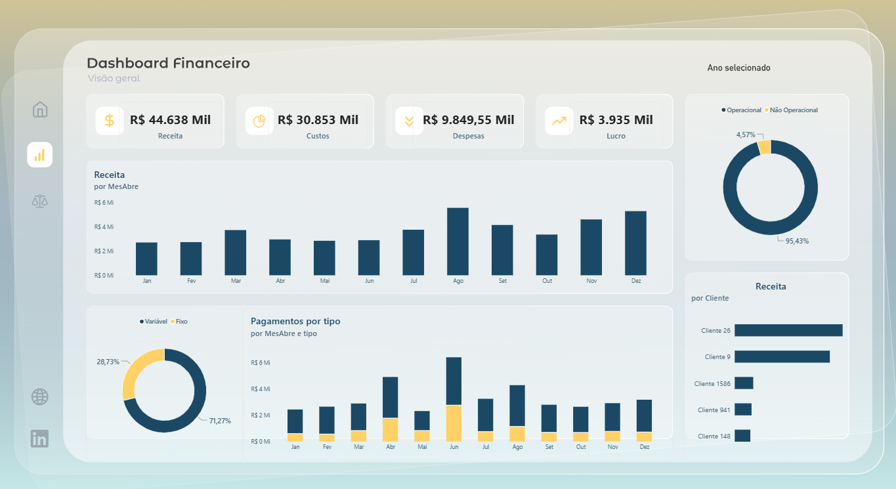
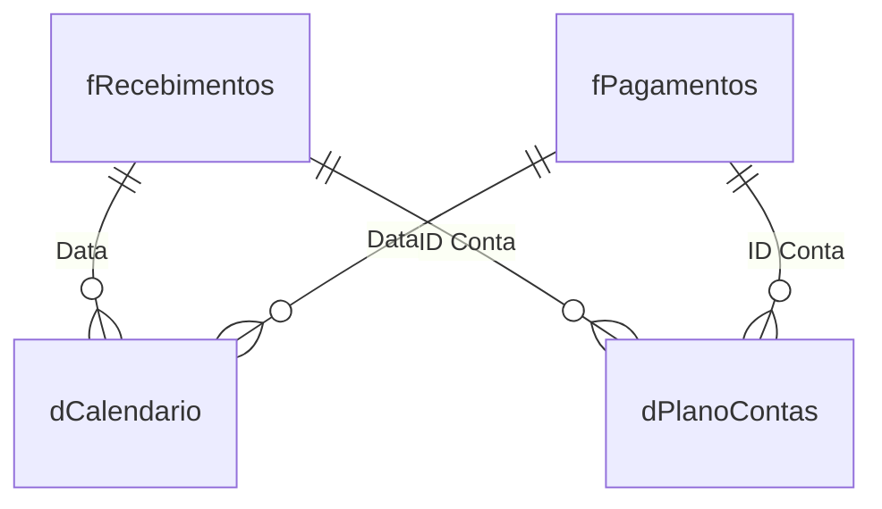

# DRE Financeiro — Receitas, Custos e Despesas

Dashboard em Power BI que consolida um **DRE (Demonstrativo de Resultado do Exercício)** a partir de bases de recebimentos e pagamentos, estruturado sobre um plano de contas, com granularidade de Receita → Custo → Despesa → Lucro.



🔗 [Relatório publicado no Power BI](https://app.powerbi.com/view?r=eyJrIjoiNTlhZmE1ZTctMzNmOS00ZGNkLWJjYTEtNGUxMDYyN2E0YjdiIiwidCI6ImNmZGQ2YTU0LTE2ZDgtNGQyYS1iMzA5LTdiMWNiMDk0YzI0MyJ9)

## Contexto

O modelo une duas frentes financeiras — o que a empresa **recebeu** de clientes e o que **pagou** de custos/despesas — e as concilia através de um **plano de contas** central, permitindo calcular margem bruta, lucro líquido e % de lucro por período, cliente, UF e categoria de conta.

## Fonte de Dados

| Item | Detalhe |
|---|---|
| Origem | Excel (`.xlsx`) e pasta com múltiplos arquivos, todos locais |
| Modo de conexão | Import |
| Tabelas fato | `fRecebimentos`, `fPagamentos` |
| Volume | 10.974 recebimentos · 120 lançamentos de pagamento |
| Período coberto | 01/2017 a 12/2018 |
| Clientes distintos | 1.877 |
| UFs | 26 |
| Contas no plano | 7 |

### Tratamento no Power Query (M)

**`fRecebimentos`** — ingestão de **múltiplos arquivos de uma pasta** (`Folder.Files`), com função de transformação reaplicada a cada arquivo (`Table.AddColumn` + `Transformar Arquivo`) e depois expandida em uma única tabela — padrão típico para consolidar exports mensais/diários de um sistema de origem sem intervenção manual.

**`fPagamentos`** — combinação de **duas queries anuais** (`Saidas` = 2017, `Saida2018` = 2018) via `Table.Combine`. Cada uma delas:
- Lê uma aba específica do Excel (`Saida2017` / `Saida2018`);
- Remove colunas técnicas e promove cabeçalhos;
- Aplica **unpivot** nas colunas de mês (`jan/17`, `fev/17`, ... `dez/17`) transformando o formato "largo" (uma coluna por mês) em formato "longo" (uma linha por lançamento/mês) — necessário para o modelo tabular e para análises temporais no Power BI.

**`dPlanoContas`** — leitura direta de tabela nomeada no Excel (`CadastroPlanoContas.xlsx`), sem transformações adicionais.

## Modelo de Dados

Esquema estrela com **duas tabelas fato** (recebimentos e pagamentos) compartilhando as mesmas dimensões de calendário e plano de contas.



### Tabela fato `fRecebimentos`

| Coluna | Tipo | Descrição |
|---|---|---|
| `Data` | Data | Data do recebimento |
| `ID Conta` | Inteiro | Chave para `dPlanoContas` |
| `Cliente` | Texto | Cliente pagador |
| `UF` | Texto | Estado do cliente |
| `valor_recebido` | Moeda | Valor recebido |

### Tabela fato `fPagamentos`

| Coluna | Tipo | Descrição |
|---|---|---|
| `ID Conta` | Texto | Chave para `dPlanoContas` |
| `Data` | Data | Mês/ano do pagamento (originado do unpivot) |
| `Valor_Pagamento` | Moeda | Valor pago no período |

### Tabela `dPlanoContas`

Estrutura hierárquica de classificação contábil:

| id | movimento | lancamento | conta | tipo |
|---|---|---|---|---|
| 11 | Entrada | Receita | Operacional | Receita |
| 12 | Entrada | Receita | Não Operacional | Receita |
| 21 | Saída | Custo | Operacional | Fixo |
| 22 | Saída | Custo | Operacional | Variável |
| 31 | Saída | Despesa | Operacional | Fixo |
| 32 | Saída | Despesa | Operacional | Variável |
| 33 | Saída | Despesa | Não Operacional | Fixo |

> É essa coluna `lancamento` (Receita / Custo / Despesa) que as medidas DAX usam para segmentar `fPagamentos` entre Custos e Despesas.

## Relacionamentos

| De | Coluna | Para | Cardinalidade | Filtro |
|---|---|---|---|---|
| fRecebimentos | Data | dCalendario | Muitos-para-um | Direção única |
| fPagamentos | Data | dCalendario | Muitos-para-um | Direção única |
| dCalendario | Data | Date Table (auto) | Muitos-para-um | Direção única |
| fRecebimentos | ID Conta | dPlanoContas | Muitos-para-um | Direção única |
| fPagamentos | ID Conta | dPlanoContas | Muitos-para-um | Direção única |

## Medidas DAX

| Medida | Fórmula | Descrição |
|---|---|---|
| `Receita` | `SUM(fRecebimentos[valor_recebido])` | Total recebido no período |
| `Pagamentos` | `SUM(fPagamentos[Valor_Pagamento])` | Total pago no período (custo + despesa) |
| `Custos` | `CALCULATE([Pagamentos], dPlanoContas[lancamento] = "Custo")` | Fatia de pagamentos classificada como custo |
| `Despesas` | `CALCULATE([Pagamentos], dPlanoContas[lancamento] = "Despesa")` | Fatia de pagamentos classificada como despesa |
| `Margem Bruta` | `[Receita] - [Custos]` | Receita menos custos diretos |
| `Lucro` | `[Receita] - [Custos] - [Despesas]` | Resultado líquido do período |
| `% Lucro` | `[Lucro] / [Receita]` | Margem líquida percentual |

**Hierarquia do DRE construída pelas medidas:**
```
Receita
  (-) Custos        → Margem Bruta
  (-) Despesas       → Lucro
                        % Lucro = Lucro / Receita
```

## Principais números do dashboard

- **Receita**: R$ 44.638 Mil
- **Custos**: R$ 30.853 Mil
- **Despesas**: R$ 9.849,55 Mil
- **Lucro**: R$ 3.935 Mil (≈ 8,8% de margem líquida)
- Receita concentrada em contas **Operacionais** (95,43%) vs. Não Operacionais (4,57%)
- Pagamentos majoritariamente **Variáveis** (71,27%) vs. Fixos (28,73%)
- Mês de maior receita: **Agosto**
- Maiores clientes em receita: **Cliente 26**, **Cliente 9**, **Cliente 1586**

## Stack Técnica

- **Power BI Desktop**
- **Power Query (M)**: consolidação de múltiplos arquivos de pasta (`fRecebimentos`), combinação de queries anuais e unpivot de colunas mensais (`fPagamentos`)
- **DAX**: medidas de DRE encadeadas (Receita → Margem → Lucro), segmentadas via plano de contas
- Fontes: planilhas Excel locais + pasta com múltiplos arquivos
