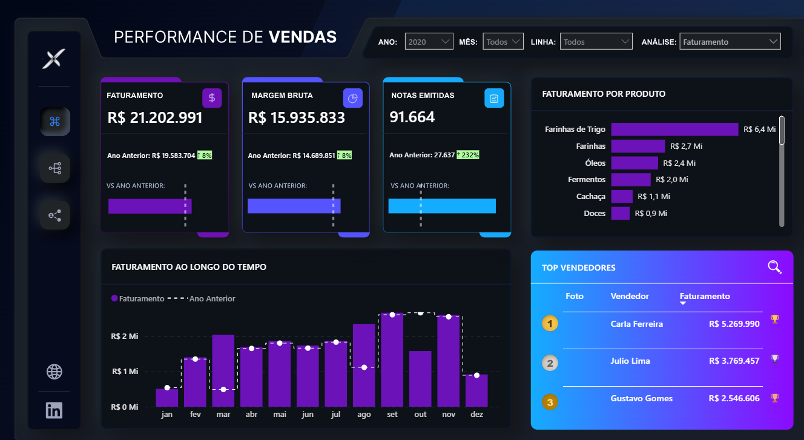
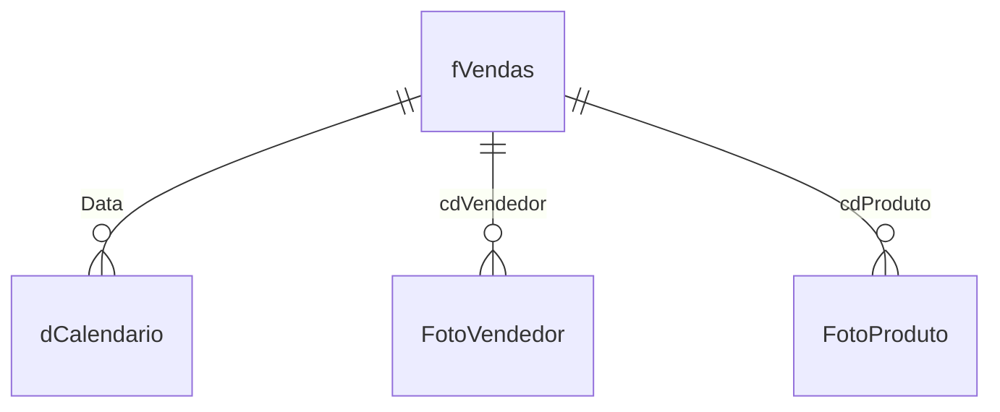

# Dashboard de Vendas — Análise de Faturamento e Margem (EV16)

Dashboard em Power BI para acompanhamento de faturamento, custos e margem bruta, com comparativos ano contra ano (YoY) e troca dinâmica de métrica via segmentação.



🔗 [Relatório publicado no Power BI](https://app.powerbi.com/view?r=eyJrIjoiYzZjMzc4Y2QtOWQ4Yi00ODVmLTliOGYtMDc4ZmNmYWNiNTQzIiwidCI6ImNmZGQ2YTU0LTE2ZDgtNGQyYS1iMzA5LTdiMWNiMDk0YzI0MyJ9)

## Contexto

O modelo centraliza as vendas de uma equipe comercial (produtos, vendedores, faturamento e custo) e permite alternar entre visualizar **Faturamento** ou **Margem Bruta** nos mesmos visuais, usando um parâmetro de campo (field parameter) controlado pela tabela `auxAnalise`.

## Fonte de Dados

| Item | Detalhe |
|---|---|
| Origem | Arquivos Excel (`.xlsx`) locais — `Vendas.xlsx`, `FotoVendedores.xlsx`, `FotoProdutos.xlsx` |
| Modo de conexão | Import |
| Tabela fato | `fVendas` |
| Volume | 265.549 linhas |
| Período coberto | 01/01/2019 a 24/12/2020 |
| Vendedores distintos | 12 |
| Produtos distintos | 658 |

### Tratamento no Power Query (M)

- **fVendas**: leitura da planilha `PlanilhaVendas`, promoção de cabeçalhos, conversão de tipos (datas, inteiros, texto, decimais).
- **FotoVendedor**: leitura de planilha auxiliar com foto/URL por `cdVendedor`, usada para exibir avatar do vendedor nos visuais.
- **FotoProduto**: leitura de planilha auxiliar com foto por `Cod Produto`; código extraído de um texto (`Text.AfterDelimiter`) e convertido para inteiro.
- Caminhos dos arquivos resolvidos via parâmetro `Diretorio` (permite trocar a pasta de origem sem editar cada query).

## Modelo de Dados

Esquema estrela: tabela fato `fVendas` conectada a uma dimensão calendário, duas dimensões de "foto" (imagens para cartões visuais) e uma tabela auxiliar de parâmetro de campo para troca de métrica.



### Tabela fato `fVendas`

| Coluna | Tipo | Descrição |
|---|---|---|
| `NFe` | Inteiro | Número da nota fiscal |
| `cdProduto` | Inteiro | Código do produto |
| `cdVendedor` | Inteiro | Código do vendedor |
| `Equipe Vendas` | Texto | Equipe/time do vendedor |
| `QtdItens` | Inteiro | Quantidade de itens vendidos |
| `PrecoUnitario` | Decimal | Preço unitário de venda |
| `Data` | Data | Data da venda |
| `Grupo Produto` | Texto | Grupo do produto |
| `Linha Produto` | Texto | Linha do produto |
| `Fornecedor` | Texto | Fornecedor do produto |
| `Vendedor` | Texto | Nome do vendedor |
| `CustoUnitario` | Decimal | Custo unitário do item |

### Tabela `dCalendario`

Gerada via `CALENDARAUTO()`, com colunas calculadas: `Ano`, `Mês Num`, `Mês`, `Mês Abrev`, `Mês/Ano`.

### Tabelas de apoio

| Tabela | Origem | Uso |
|---|---|---|
| `FotoVendedor` | Excel | Imagem do vendedor (categoria `ImageURL`), relacionada por `cdVendedor` |
| `FotoProduto` | Excel | Imagem do produto, relacionada por `cdProduto` ↔ `Cod Produto` |
| `auxAnalise` | Tabela calculada (`DAX`) | Parâmetro de campo para alternar entre Faturamento e Margem Bruta nos visuais |

## Relacionamentos

| De | Coluna | Para | Cardinalidade | Filtro |
|---|---|---|---|---|
| fVendas | Data | dCalendario | Muitos-para-um | Direção única |
| dCalendario | Data | Date Table (auto) | Muitos-para-um | Direção única |
| fVendas | cdVendedor | FotoVendedor | Muitos-para-um | Direção única |
| fVendas | cdProduto | FotoProduto | Muitos-para-um | **Ambas as direções** |

> A relação `fVendas` ↔ `FotoProduto` está configurada com filtro bidirecional, permitindo que seleções na tabela de fotos filtrem também a fato.

## Medidas DAX

### Medidas padrão

| Medida | Fórmula | Descrição |
|---|---|---|
| `Faturamento` | `SUMX(fVendas, fVendas[QtdItens] * fVendas[PrecoUnitario])` | Receita bruta de vendas |
| `Notas Emitidas` | `DISTINCTCOUNT(fVendas[NFe])` | Total de notas fiscais únicas |
| `Custos` | `SUMX(fVendas, fVendas[QtdItens] * fVendas[CustoUnitario])` | Custo total dos itens vendidos |
| `Margem Bruta` | `[Faturamento] - [Custos]` | Lucro bruto |

### Medidas temporais (YoY)

| Medida | Fórmula | Descrição |
|---|---|---|
| `Referência Faturamento LY` | `CALCULATE([Faturamento], SAMEPERIODLASTYEAR(dCalendario[Data]))` | Faturamento do ano anterior |
| `Referência Margem Bruta LY` | `CALCULATE([Margem Bruta], SAMEPERIODLASTYEAR(dCalendario[Data]))` | Margem do ano anterior |
| `Referência Notas Emitidas LY` | `CALCULATE([Notas Emitidas], SAMEPERIODLASTYEAR(dCalendario[Data]))` | Notas emitidas no ano anterior |
| `% Faturamento YoY` | `DIVIDE([Faturamento] - [Referência Faturamento LY], [Referência Faturamento LY])` | Variação percentual do faturamento vs. ano anterior |
| `% Margem Bruta YoY` | `DIVIDE([Margem Bruta] - [Referência Margem Bruta LY], [Referência Margem Bruta LY])` | Variação percentual da margem vs. ano anterior |
| `% Notas Emitidas YoY` | `DIVIDE([Notas Emitidas] - [Referência Notas Emitidas LY], [Referência Notas Emitidas LY])` | Variação percentual de notas vs. ano anterior |
| `Detalhe Faturamento YoY` | `FORMAT([% Faturamento YoY], " ⇡ 0%;  ⇣ 0%")` | Texto formatado com seta de variação |
| `Detalhe Margem YoY` | `FORMAT([% Margem Bruta YoY], " ⇡ 0%;  ⇣ 0%")` | Texto formatado com seta de variação |
| `Detalhe Notas Emitidas YoY` | `FORMAT([% Notas Emitidas YoY], " ⇡ 0%;  ⇣ 0%")` | Texto formatado com seta de variação |

### Medidas dinâmicas (troca de métrica)

Implementam um padrão de **field parameter manual**, alternando entre Faturamento e Margem Bruta conforme a seleção do usuário em `auxAnalise`.

| Medida | Fórmula | Descrição |
|---|---|---|
| `ID Selecionado` | `SELECTEDVALUE(auxAnalise[auxAnalise Pedido])` | Captura qual métrica está selecionada (0 ou 1) |
| `Medida Selecionada` | `IF([ID Selecionado] = 0, [Faturamento], [Margem Bruta])` | Retorna o valor da métrica ativa |
| `Medida Selecionada LY` | `IF([ID Selecionado] = 0, [Referência Faturamento LY], [Referência Margem Bruta LY])` | Valor do ano anterior da métrica ativa |
| `Titulo` | `UPPER(VALUES(auxAnalise[auxAnalise]))` | Título dinâmico com o nome da métrica selecionada |
| `Titulo (por Produto)` | `IF([ID Selecionado] = 0, "FATURAMENTO", "MARGEM BRUTA") & " POR PRODUTO"` | Título dinâmico do visual "por produto" |
| `Titulo (ao longo do tempo)` | `IF([ID Selecionado] = 0, "FATURAMENTO", "MARGEM BRUTA") & " AO LONGO DO TEMPO"` | Título dinâmico do visual de série temporal |

**Tabela `auxAnalise` (parâmetro de campo):**
```dax
auxAnalise =
{
    ("Faturamento", NAMEOF('Medidas'[Faturamento]), 0),
    ("Margem Bruta", NAMEOF('Medidas'[Margem Bruta]), 1)
}
```

## Principais números do dashboard (Ano de referência: 2020)

- **Faturamento**: R$ 21.202.991 (+8% vs. ano anterior)
- **Margem Bruta**: R$ 15.935.833 (+8% vs. ano anterior)
- **Notas Emitidas**: 91.664 (+232% vs. ano anterior)
- Top categoria de produto: **Farinhas de Trigo** (R$ 6,4 Mi)
- Top vendedora: **Carla Ferreira** (R$ 5.269.990)

## Stack Técnica

- **Power BI Desktop**
- **Power Query (M)** para ETL, com parâmetro de diretório reutilizável
- **DAX** para medidas, comparativos YoY e field parameter manual
- Fontes: planilhas Excel locais (vendas + tabelas de apoio com imagens)
