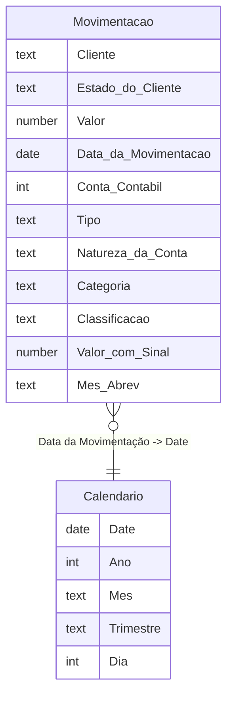

# Modelo de Dados

## Tabelas

| Tabela | Tipo | Origem | Linhas visíveis |
|---|---|---|---|
| `Movimentação` | Fato | Power Query (Excel) | Sim |
| `LocalDateTable_*` | Calendário (auto date/time do Power BI) | Gerada automaticamente | Oculta |

## Diagrama de relacionamento



## Relacionamento

| De | Coluna | Cardinalidade | Para | Coluna | Direção do filtro |
|---|---|---|---|---|---|
| `Movimentação` | `Data da Movimentação` | N:1 | `LocalDateTable` (calendário) | `Date` | Único sentido (calendário → fato) |

## Colunas calculadas

### `Valor com Sinal`
Inverte o sinal do valor quando o tipo do lançamento é uma saída, permitindo somar entradas e saídas na mesma medida sem cancelar o sinal.

```dax
Valor com Sinal =
IF (
    'Movimentação'[Tipo] = "Saída",
    -'Movimentação'[Valor],
    'Movimentação'[Valor]
)
```

### `Mês Abrev`
Extrai a abreviação do mês (ex.: "jan", "fev") a partir da data do lançamento — usada como eixo no gráfico de evolução.

```dax
Mês Abrev = FORMAT('Movimentação'[Data da Movimentação], "mmm")
```

## Medidas DAX

Nenhuma medida explícita foi criada neste modelo até o momento — os totais dos visuais usam agregação implícita (`Sum`) sobre `Valor` / `Valor com Sinal`.

> **Recomendação para o portfólio:** ao evoluir este projeto, vale formalizar KPIs como `Receita`, `Custo`, `Despesa` e `Lucro` como medidas DAX explícitas (com `CALCULATE` filtrando `Natureza da Conta`), em vez de depender de agregação implícita — fica mais reutilizável e documentável.
