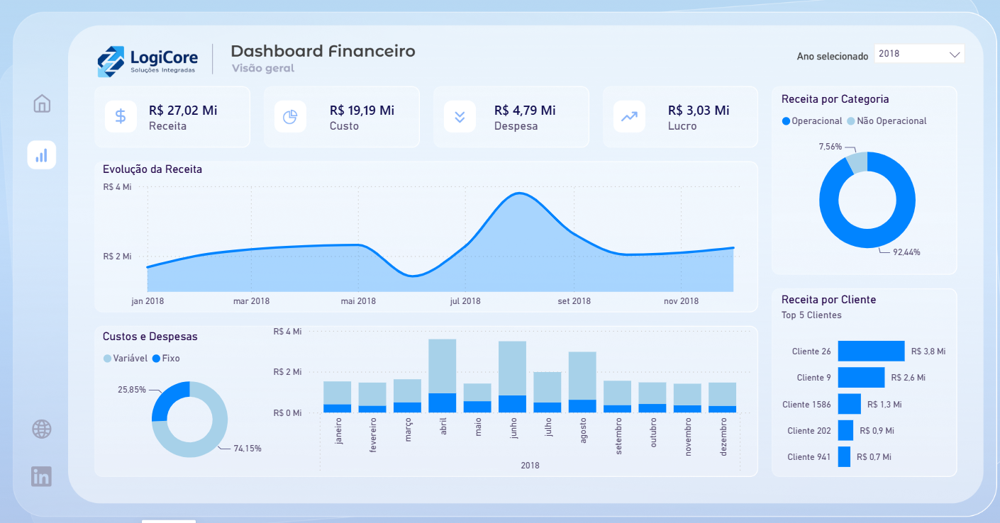

# Visualização — Dashboard Financeiro

O relatório é composto por uma única página ("Visão geral") com um slicer global de ano e 7 visuais.

## Filtro global

| Visual | Campo | Tipo |
|---|---|---|
| Ano selecionado | `Movimentação[Data da Movimentação]` (Ano) | Slicer / dropdown |

## Cartões de KPI

| Cartão | Valor exibido | Campo/medida provável |
|---|---|---|
| Receita | R$ 27,02 Mi | `SUM(Valor com Sinal)` filtrado por `Natureza da Conta = "Receita"` |
| Custo | R$ 19,19 Mi | `SUM(Valor com Sinal)` filtrado por `Natureza da Conta = "Custo"` |
| Despesa | R$ 4,79 Mi | `SUM(Valor com Sinal)` filtrado por `Natureza da Conta = "Despesa"` |
| Lucro | R$ 3,03 Mi | Receita − Custo − Despesa |

## Evolução da Receita

| Propriedade | Detalhe |
|---|---|
| Tipo de gráfico | Linha / área |
| Eixo X | `Mês Abrev` (ou `Data da Movimentação` por mês) |
| Eixo Y | `Valor com Sinal` (soma) |
| Filtro implícito | `Natureza da Conta = "Receita"` |

## Receita por Categoria

| Propriedade | Detalhe |
|---|---|
| Tipo de gráfico | Rosca (donut) |
| Categoria | `Classificação` (valores: Operacional / Não Operacional) |
| Valores | `Valor com Sinal` (soma) |

## Custos e Despesas (rosca)

| Propriedade | Detalhe |
|---|---|
| Tipo de gráfico | Rosca (donut) |
| Categoria | `Categoria` (valores: Fixo / Variável) |
| Valores | `Valor com Sinal` (soma) |

## Custos e Despesas (colunas empilhadas por mês)

| Propriedade | Detalhe |
|---|---|
| Tipo de gráfico | Colunas empilhadas |
| Eixo X | `Mês Abrev` |
| Séries | `Categoria` (Fixo / Variável) |
| Valores | `Valor com Sinal` (soma) |
| Filtro implícito | `Natureza da Conta` in (Custo, Despesa) |

## Receita por Cliente — Top 5

| Propriedade | Detalhe |
|---|---|
| Tipo de gráfico | Barras horizontais |
| Eixo | `Cliente` |
| Valores | `Valor com Sinal` (soma) |
| Filtro | Top 5 por valor, `Natureza da Conta = "Receita"` |

---

> **Sobre esta documentação:** os campos acima foram inferidos combinando o layout do dashboard com o esquema real do modelo (extraído via conexão ao Power BI). Como o `Classificação` e a `Categoria` ainda não têm um dicionário de valores documentado na fonte, confirme os rótulos exatos (`Operacional`/`Não Operacional`, `Fixo`/`Variável`, valores de `Natureza da Conta`) antes de publicar como referência definitiva.
